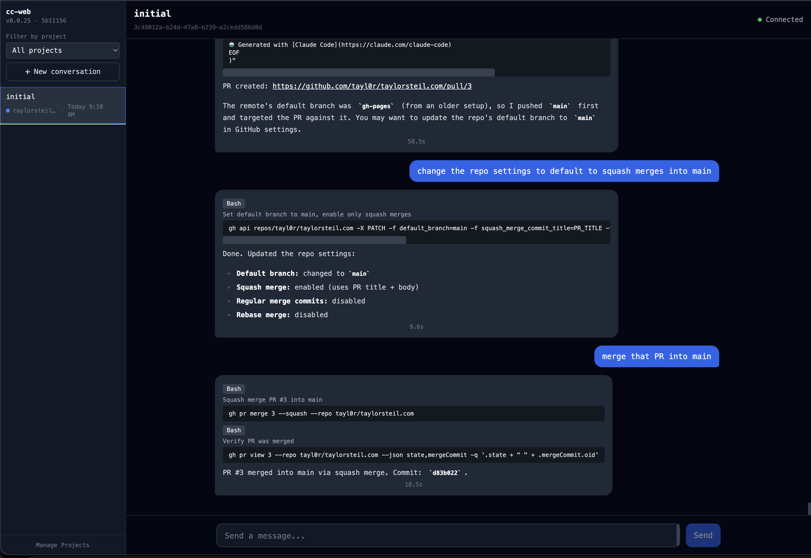

# Catalyst Agent

A web-based chat interface that wraps the [Claude Code CLI](https://docs.anthropic.com/en/docs/claude-code) with real-time streaming, conversation management, and project organization.



## Features

- Real-time streaming responses from Claude Code
- Conversation history with session persistence
- Project organization for grouping conversations
- Rich rendering of tool use, thinking blocks, and markdown
- WebSocket-based communication for low-latency updates

## Architecture

Three-tier: **React client** → **WebSocket** → **Node server** → **spawned Claude CLI process**

## Prerequisites

- [Node.js](https://nodejs.org/) (v18+)
- [pnpm](https://pnpm.io/) (v10+) — or enable via corepack: `corepack enable`
- [Claude Code CLI](https://docs.anthropic.com/en/docs/claude-code) installed and authenticated

## Getting Started

```bash
pnpm install      # Install all dependencies
pnpm run dev      # Start server (port 2999) + client (port 2998)
```

Then open [http://localhost:2998](http://localhost:2998) in your browser.

## Tech Stack

- **Client:** React 19, Vite 6, Tailwind CSS, TypeScript
- **Server:** Node.js, Express, WebSocket (`ws`), TypeScript
- **Shared:** Common types imported via `@shared` path alias

## License

[GNU AGPLv3](LICENSE)
